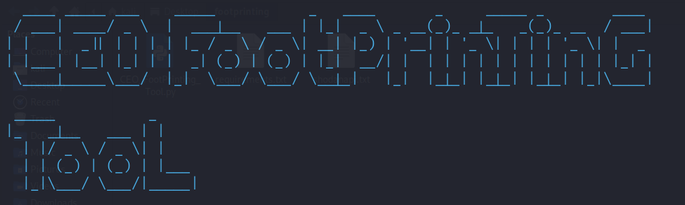

<p align="center">
  
</p>

<p align="center">
  
  
  
  
  
  
  
</p>

# :mag: Footprinting Tool

**CEO_Footprinting_Tool is an advanced domain reconnaissance and firewal detection tool.**

**This tool integrates multiple powerful modules, including, Nmap, Subfinder, Amass, Shodan, and others.**

**It helps users gather information about domains and perform reconnaissance with accuracy. Proxies and anonymity features ensure safe and private operations.**

<br>

# :heavy_exclamation_mark: DISCLAIMER
**This tool is intended for educational and research purposes only. The creator does not take responsibility for improper use of this tool.**

<br>

# :heavy_check_mark: INSTALLATION GUIDE (Linux/Mac):

```bash
# Clone the repository
git clone https://github.com/ceotools/footprinting

# Navigate to the tool's directory
cd footprinting

# Install Python requirements
pip install -r requirements.txt

# Install necessary system packages
sudo apt install whois traceroute dnsutils
# Also download Photon manually for no error
sudo apt install photon
```

<br>

# :heavy_check_mark: INSTALLATION IN VIRTUAL ENVIRONMENT (Optional):

**If you encounter issues with Python libraries, use a virtual environment:**

```bash
# Create and activate a virtual environment
python3 -m venv .env
source .env/bin/activate

# Install Python requirements
pip install -r requirements.txt
```

<br>

# :gear: USAGE:
```bash
cd footprinting
sudo su
python3 CEO_FootPrinting_Tool.py
```

<br>

# :heavy_exclamation_mark: KEY FEATURES:
1. **Domain Reconnaissance:**
   - Retrieve subdomains, IP addresses, and server details.
   - Perform DNS lookups and WHOIS queries.

2. **Cloudflare Bypass:**
   - Utilize CloudFail and WAFNinja to bypass protection layers.

3. **Integrated Tools:**
   - Subfinder, Amass, Shodan for comprehensive reconnaissance.

4. **Anonymity Features:**
   - Use proxies to anonymize requests.

5. **Advanced Scanning:**
   - Incorporate Nmap for port scanning and service discovery.

<br>

# SCREENSHOTS:


<p align="center">
</p>

<br>


<br>


<br>

# :rocket: ROADMAP:

- Add support for more APIs and reconnaissance tools.
- Enhance GUI for better user experience.

<br>


<br>

# LICENSE:
This project is licensed under the **GPL-3.0 License**.

<br>

## <p align="center">MADE WITH :heart: BY CEO </p>
